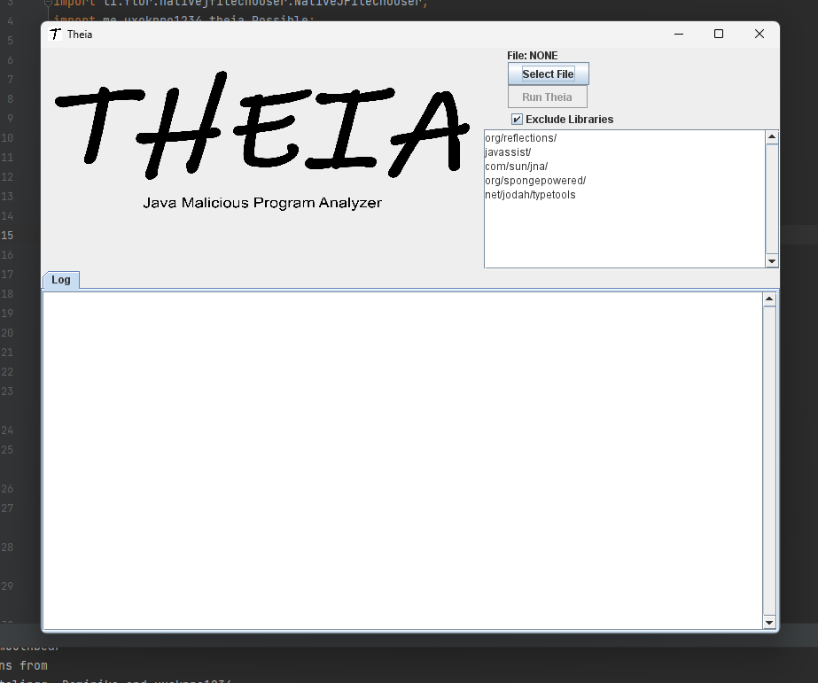

<h1>Theia</h1>
    
<strong>Legendary Java program for analyzing and discovering Java backdoors. Mainly for minecraft forge 1.12.2.</strong>

    
While i was browsing trough my starred repositories, i came across Theia, which has been discontinued for a long time, and i decided to port it to java and update.

<h2>Overview</h2>
    
Theia is designed to inspect Java files (JARs, projects) and detect potential backdoors, unsafe code, or suspicious patterns. It can be run in two ways:

    <ul>
        <li><strong>GUI Mode:</strong> Open an interactive graphical interface.</li>
        <li><strong>CLI Mode:</strong> Run from the command line on a specific file with optional exclusions.</li>
    </ul>

<h2>Usage</h2>

Command-line syntax:

<pre>java -jar theia.jar [file] [exclusions]</pre>

<h2>Features</h2>
    <ul>
        <li>Graphical User Interface with file selection and logging.</li>
        <li>Customizable exclusions for libraries or safe packages.</li>
        <li>Detailed log panel and table output for findings.</li>
        <li>Multiple checks for detecting suspicious classes and methods.</li>
        <li>Lightweight, fast, and extendable.</li>
    </ul>

<h2>Default Exclusions</h2>
    <ul>
        <li>org/reflections/</li>
        <li>javassist/</li>
        <li>com/sun/jna/</li>
        <li>org/spongepowered/</li>
        <li>net/jodah/typetools</li>
    </ul>

<h2>Credits & Shoutouts</h2>
    
Created by <strong>Tigermouthbear</strong> with contributions from <strong>GiantNuker, Crystalinqq, Dominika, and uxokpro1234</strong>.

    
Shoutout to the official repository: <a href="https://github.com/Tigermouthbear/Theia">https://github.com/Tigermouthbear/Theia</a>

    
Current version: <strong>v0.3</strong>

<h2>Notes</h2>
    <ul>
        <li>If you encounter a bug, please report it — it can be fixed quickly.</li>
        <li>Theia is constantly being improved to detect more backdoors and handle edge cases.</li>
        <li>Anti-aliasing is enabled in the GUI for better visual quality.</li>
    </ul>
